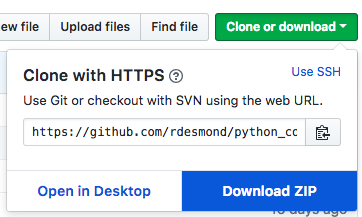
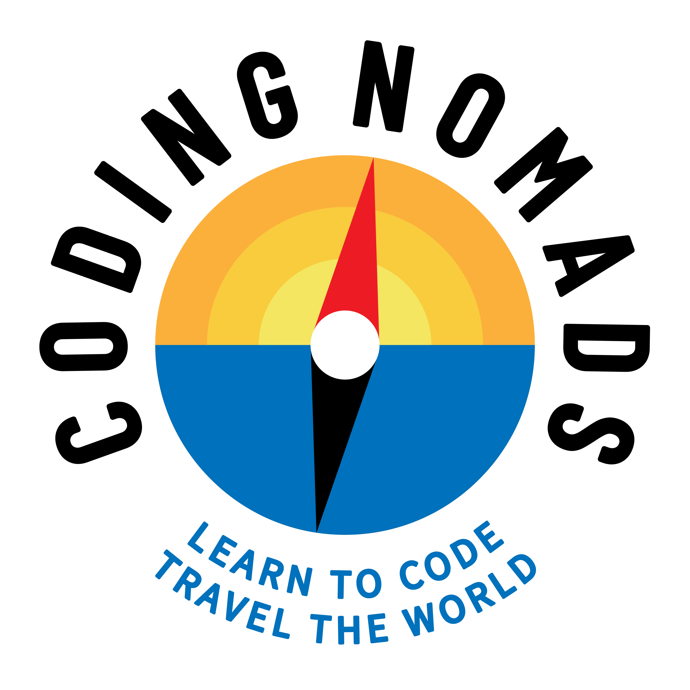

# Python for Back-End Web Development

Here you can find the labs and project instructions, as well as solutions,
for the CodingNomads 12 week Python Back-End WebDev course.

Please refer to the [Course Overview](https://codingnomads.atlassian.net/wiki/spaces/PYC/pages/426934606/Course+Overview) for the glue that ties all this together :)

---

## Download me!

After you have created a GitHub account, press the green "Clone or Download"
button at the top right of this repository. That will open a dialog from
which you can click a blue "Download ZIP" button to download the repo.

It looks like this:

Unzip the file. This folder contains **your own copy** of all the labs and
mini-project files (including solutions) that we will be working with.

Start completing the exercises locally on your computer. After you've
learned about Git and GitHub, add a new remote to the folder that points
to a fresh GitHub repository on your own GitHub account.

Push your work there, and inform the course instructors by sending a
link on Slack.

### Contributing

There is always room for improvement for our material, and as a budding
software developer, learning to contribute to a project is a great first
step e.g. to get into open-source. Therefore remember:

**We appreciate `pull` requests!**

If you don't yet know what that means, no worries! Either come back later,
or read the links below. Basically, it's easy:

If you **find a typo**, or a **mistake in the code** - or you **want to add an
exercise of your own for other students to learn from** - you can add
these improvements to the original repository.

Check out how to [create a branch](https://help.github.com/articles/creating-and-deleting-branches-within-your-repository/) and how to [create a pull request](https://help.github.com/articles/about-pull-requests/).

Keep learning! :)
