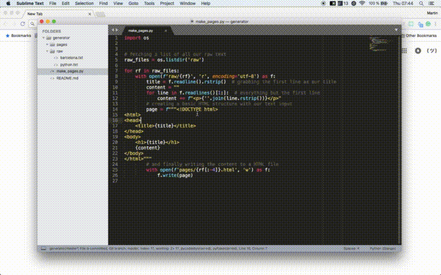

# Static page generator

Let's automate building a travel blog! 🌍🌎🌏

Python is a great choice for automating tedious tasks quickly. In this
project we will write code for an **automatic webpage generator**.

## Tasks

- Create a script called `make_pages.py` that converts any `.txt` document sitting in the `raw` folder to a simple HTML page
- Create a git repository for your travel blog and host the generated website online
- **Challenge**: Style your blog using CSS
- **Challenge**: Change the script to also include image files from the `raw` folder
